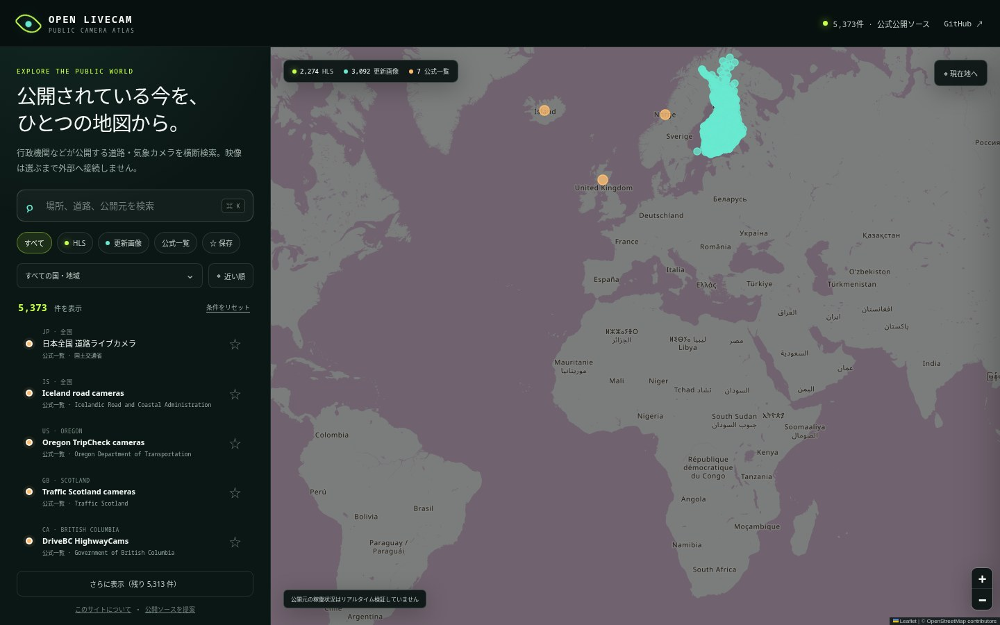

# Open LiveCam Atlas

[](https://github.com/hjosugi/livecam/actions/workflows/ci.yml)
[](https://github.com/hjosugi/livecam/actions/workflows/pages.yml)
[](https://github.com/hjosugi/livecam/releases/latest)

行政機関などが一般向けに公開している固定カメラを、世界地図から横断検索する静的 Web アプリです。

**公開サイト:** <https://hjosugi.github.io/livecam/>



## できること

- 世界地図・キーワード・国/地域・配信形式からカメラを検索
- Caltrans の HLS 配信と更新画像、Fintraffic と DriveBC の道路・気象画像を公開元から直接表示
- 日本の国土交通省など、各国の公式カメラ一覧へ移動
- 端末内だけに保存されるお気に入り
- 現在地を送信・保存せず、ブラウザ内の計算だけで「近い順」に並べ替え
- カメラ ID 付き URL の共有
- スマートフォン、タブレット、PCに対応したレスポンシブ UI

初版カタログは 2026-08-16 時点で **5,373 件**です。

| 種類 | 件数 | 内容 |
| --- | ---: | --- |
| HLS | 2,274 | 公開元が提供するストリーミング配信 |
| 更新画像 | 3,092 | 数分間隔などで更新される静止画 |
| 公式一覧 | 7 | 各機関の公式カメラポータル |

件数と稼働状況は変わります。`npm run sync:sources` で公式 API からカタログを更新できます。

## 設計上の境界

これは非公開カメラへの接続ツールでも、人を追跡する監視システムでもありません。

- 一般公開され、公開元と利用条件を確認できるソースだけを収録します。
- 外部画像・映像は利用者が明示的に「読み込む」を押すまで取得しません。
- 映像の録画、再配布、解析、顔認識、ナンバー認識、人物追跡、PTZ操作は行いません。
- 個人宅、私有施設の無断映像、認証回避を要するソースは受け付けません。
- ドローンの操作・探索機能はありません。許可された運用者による公式公開映像だけが将来の収録候補です。

詳しくは [データ方針](docs/DATA_POLICY.md) と [プライバシー設計](docs/PRIVACY.md) を参照してください。

## ローカル起動

Node.js 22.12 以上が必要です。

```bash
npm install
npm run dev
```

品質ゲート:

```bash
npm run check
```

このコマンドはカタログ検証、ユニットテスト、型検査、production build を実行します。

公開 Pages の commit SHA とカタログを読み戻す場合:

```bash
npm run verify:public -- https://hjosugi.github.io/livecam/ <full-commit-sha> 0.1.0
```

## カタログ更新

```bash
npm run sync:sources
npm run sync:check
```

更新スクリプトは映像をダウンロードしません。公式 API から位置・公開 URL・メタデータだけを取得します。Fintraffic にはサービス指定の識別ヘッダーを付け、API 応答には gzip を使用します。

収録元、帰属表示、利用条件は [SOURCES.md](SOURCES.md) にまとめています。新しい公開元の提案は [Source proposal](https://github.com/hjosugi/livecam/issues/new?template=source.yml) から送れます。

## 技術構成

- TypeScript + Vite
- Leaflet + OpenStreetMap
- hls.js（HLS を選択した時だけ遅延ロード）
- API キー、サーバー、データベース、アカウント、広告、アクセス解析なし
- GitHub Pages へ静的配信

詳細は [ARCHITECTURE.md](docs/ARCHITECTURE.md) を参照してください。

## 重要な注意

「HLS」や更新時刻は公開元のメタデータに基づき、このサイトが現在の稼働を保証する表示ではありません。災害、救助、運転判断など安全に関わる用途では、必ず現地当局の一次情報を確認してください。「世界中のすべて」を文字どおり網羅するものでもありません。

また、一般に「ライブ衛星地図」と呼ばれるサービスの多くは更新間隔のある衛星画像であり、地球上の任意地点をリアルタイム動画で見られるものではありません。このプロジェクトでは衛星画像をライブカメラと誤表示しません。

## ライセンス

アプリケーションコードは [MIT License](LICENSE) です。カメラ画像、映像、位置情報、地図データには、それぞれの公開元の著作権・ライセンス・利用条件が適用されます。MIT License はそれら第三者コンテンツには適用されません。
